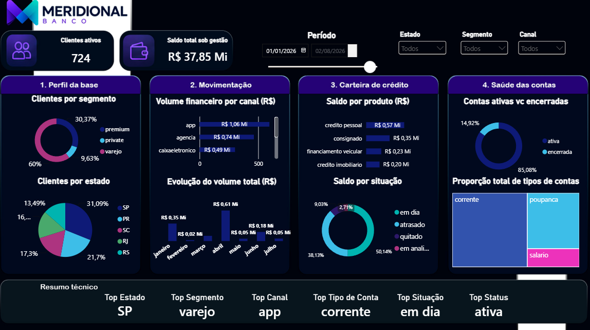

# 🏦 DashPrep

> 🇧🇷 Português | [🇺🇸 English below](#️-rpg-guild-system)

---

Pipeline de ETL em Python (Pandas) para limpeza, padronização e preparação de dados bancários brutos, com entrega final em dashboard interativo no Power BI.

Projeto desenvolvido de forma independente — o cenário de negócio e a base de dados (propositalmente "suja", simulando inconsistências reais de sistemas diferentes) foram fornecidos como desafio de mentoria, mas toda a lógica de tratamento, arquitetura do pipeline e construção do código foram desenvolvidas de forma completamente autoral.

---

## 🏢 Sobre a empresa fictícia

---

Banco Meridional S.A. é um banco múltiplo fictício fundado em 1987 em Curitiba, com atuação em varejo, private/premium banking e uma financeira de crédito (pessoal, consignado, veicular e imobiliário). Capital aberto na B3 desde 2004, com forte presença no Sul e Sudeste e operação mais enxuta no Norte/Nordeste.

O cenário do projeto: a Coordenação de Dados do banco precisa transformar uma base bruta e inconsistente — acumulada ao longo de anos, com formatos de sistemas diferentes — em uma fonte única, limpa e confiável, pronta para virar dashboard de gestão.

---

## 🎯 Problema de negócio

---

A base fornecida contém ~4.300 registros distribuídos em 4 tabelas relacionadas (clientes, contas, empréstimos, transações), com sujeira real e intencional: nomes de coluna inconsistentes, encoding quebrado, formatos de data e moeda mistos, categorias divergentes, duplicatas e falhas de integridade referencial entre tabelas. O desafio não era só limpar — era decidir o que fazer com cada tipo de inconsistência sem comprometer a informação de negócio.

---

## 🚀 Tecnologias & conceitos aplicados

---

- Pandas — leitura de CSV/Excel, filtragem, tratamento e exportação de DataFrames
- Padronização de nomes de coluna
- Conversão de valores monetários em formatos mistos (BR/decimal) para float, com `pd.to_numeric(errors='coerce')`
- Padronização de formatos de data para `datetime`
- Detecção de formato a nível de coluna (`.str.contains(',').any()`) em vez de inferência por nome de coluna
- Guarda de tipo com `isinstance(x, str)` antes de aplicar operações de string
- Remoção e substituição de caracteres especiais, correção de encoding
- Iteração sobre múltiplas tabelas com função de tratamento reutilizável
- Separação de responsabilidades em módulos (`functions/`, `variables/`)
- Exportação de dados tratados para consumo externo (Power BI)

---

## 🧠 Decisões técnicas

---

- **Não remover linhas com problema.** Decisão consciente de negócio: descartar registros inconsistentes geraria perda relevante de informação para a análise agregada do banco. Optei por tratar/normalizar em vez de excluir, mesmo quando isso exigiu mais lógica de tratamento.
- **Detecção de formato por conteúdo da coluna, não pelo nome.** Colunas de valor podiam vir com formatos diferentes mesmo dentro da mesma tabela — verificar o conteúdo real (presença de vírgula, por exemplo) se mostrou mais confiável do que assumir um padrão fixo por nome de coluna.
- **Arquitetura modular.** Separei leitura (`functions/read.py`), tratamento (`functions/treatment.py`) e definição das tabelas (`variables/tables.py`) do `main.py`, que fica responsável só por orquestrar o fluxo — iterar sobre as tabelas, acionar leitura/tratamento e exportar o resultado.
- **Feedback de conclusão explícito ao usuário.** Optei por manter uma pausa de confirmação entre a exportação de cada tabela — decisão de UX intencional para acompanhar o processamento passo a passo, não um resquício de debug esquecido no código.

---

## ⚠️ Maiores desafios

---

- Import e export de tabelas entre formatos diferentes
- Visualização e inspeção de tabelas com Pandas durante o desenvolvimento
- Iteração consistente entre as 4 tabelas com uma única função de tratamento
- Correção de encoding quebrado
- Conexão e integração entre as funções do pipeline (leitura → tratamento → exportação)
- Remoção de caracteres especiais/indesejados
- Afunilamento das escolhas possíveis de tratamento para cada tipo de inconsistência
- Conversão de valores monetários e de data para `float`/`date` a partir de formatos mistos
- Padronização de nomes de coluna
- Padronização do formato de data
- Troca/normalização de caracteres
- Normalização de entradas monetárias em formatos divergentes

---

## 📊 Dashboard (Power BI)

---

Painel interativo com 4 blocos de análise — perfil da base de clientes, movimentação financeira por canal, carteira de crédito por produto/situação e saúde das contas (ativas x encerradas) — com filtros por período, estado, segmento e canal.



---

## 🗂️ Estrutura do projeto

---

```
DashPrep/
├── data/            # base de dados bruta fornecida
├── functions/       # funções de leitura e tratamento dos dados
├── variables/       # definição das tabelas do pipeline
├── package/         # dependências/configuração do projeto
├── folder_result/   # CSVs tratados exportados pelo pipeline
└── main.py          # orquestração do fluxo ETL
```

---

## ▶️ Como executar

---

```
git clone https://github.com/oJuanMarco/DashPrep
cd DashPrep
pip install -r requirements.txt
python main.py
```

O script processa as 4 tabelas em sequência, exportando uma versão tratada de cada uma. Os arquivos gerados podem ser conectados diretamente ao Power BI para reconstrução do dashboard.

---

## 👤 Autor

---

**Juan Marco**
[](https://www.linkedin.com/in/ojuanmarco/)
[](https://github.com/oJuanMarco)
---

---

# 🏦 DashPrep

Python (Pandas) ETL pipeline for cleaning, standardizing, and preparing raw banking data, delivered as an interactive Power BI dashboard.

An independently developed project — the business scenario and dataset (deliberately "dirty", simulating real inconsistencies from different source systems) were provided as a mentorship challenge, but all cleaning logic, pipeline architecture, and code were developed entirely and autonomously by the author.

## 🏢 About the fictional company

Banco Meridional S.A. is a fictional multi-service bank founded in 1987 in Curitiba, Brazil, operating in retail banking, private/premium banking, and a credit finance arm (personal, payroll-deductible, vehicle, and mortgage loans). Publicly listed on the B3 stock exchange since 2004, with strong presence in the South and Southeast regions and a leaner footprint in the North/Northeast.

Project scenario: the bank's Data Coordination team needs to turn a raw, inconsistent dataset — accumulated over years, mixing formats from different systems — into a single, clean, reliable source ready to become a management dashboard.

---

## 🎯 Business problem

---

The provided dataset holds roughly 4,300 records across 4 related tables (customers, accounts, loans, transactions), with real and intentional dirtiness: inconsistent column names, broken encoding, mixed date and currency formats, divergent categories, duplicates, and referential integrity issues across tables. The challenge wasn't just cleaning — it was deciding what to do with each type of inconsistency without losing business-relevant information.

---

## 🚀 Technologies & concepts applied

---

- Pandas — reading CSV/Excel, filtering, cleaning, and exporting DataFrames
- Column name standardization
- Converting mixed-format (BR/decimal) monetary values to float, using `pd.to_numeric(errors='coerce')`
- Standardizing date formats to `datetime`
- Column-level format detection (`.str.contains(',').any()`) instead of inferring from column names
- Type guarding with `isinstance(x, str)` before applying string operations
- Removing/replacing special characters, fixing encoding issues
- Iterating over multiple tables with a reusable cleaning function
- Separation of concerns across modules (`functions/`, `variables/`)
- Exporting cleaned data for external consumption (Power BI)

---

## 🧠 Technical decisions

---

- **Never dropping rows with issues.** A deliberate business decision: discarding inconsistent records would mean a significant loss of information for the bank's aggregate analysis. I chose to normalize/treat rather than exclude, even when it required more elaborate cleaning logic.
- **Format detection by column content, not column name.** Value columns could arrive in different formats even within the same table — checking the actual content (e.g. presence of a comma) proved more reliable than assuming a fixed pattern based on column name.
- **Modular architecture.** I separated reading (`functions/read.py`), cleaning (`functions/treatment.py`), and table definitions (`variables/tables.py`) from `main.py`, which is only responsible for orchestrating the flow — iterating through tables, triggering reading/cleaning, and exporting the result.
- **Explicit completion feedback to the user.** I kept a confirmation pause between each table's export — an intentional UX decision to track the process step by step, not a leftover debug artifact.

---

## ⚠️ Main challenges

---

- Importing and exporting tables across different formats
- Inspecting and viewing tables with Pandas during development
- Consistent iteration across the 4 tables using a single cleaning function
- Fixing broken encoding
- Connecting and integrating the pipeline's functions (read → clean → export)
- Removing special/unwanted characters
- Narrowing down the possible treatment choices for each type of inconsistency
- Converting monetary and date values to `float`/`date` from mixed formats
- Standardizing column names
- Standardizing date format
- Character replacement/normalization
- Normalizing monetary entries in divergent formats

---

## 📊 Dashboard (Power BI)

---

Interactive panel with 4 analysis blocks — customer base profile, financial movement by channel, credit portfolio by product/status, and account health (active vs. closed) — with filters by period, state, segment, and channel.


---

## 🗂️ Project structure

---

```
DashPrep/
├── data/            # raw dataset provided
├── functions/       # reading and cleaning functions
├── variables/       # pipeline table definitions
├── package/         # project dependencies/configuration
├── folder_result/   # cleaned CSVs exported by the pipeline
└── main.py          # ETL flow orchestration
```

---

## ▶️ How to run

---

```
git clone https://github.com/oJuanMarco/DashPrep
cd DashPrep
pip install -r requirements.txt
python main.py
```

The script processes the 4 tables in sequence, exporting a cleaned version of each. The generated files can be connected directly to Power BI to rebuild the dashboard.

---

## 👤 Author

---

**Juan Marco**
[](https://www.linkedin.com/in/ojuanmarco/)
[](https://github.com/oJuanMarco)
